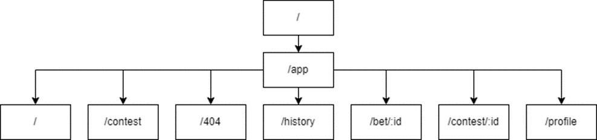

# Frontend

This project was generated with [Angular CLI](https://github.com/angular/angular-cli) version 16.0.0.

Angular Frontend connected to a Spring Boot backend.

The frontend is as simple as possible to just show the logic of authentication via a JWT.


## Run on local

```
yarn start
```

The application will run on `http://localhost:4200`

## Components

### App Component

Main wrapper component. It has no logic inside. It just places the Header and the AppContent.

### Outer Module

The “outer” module contains components that are displayed for unauthorized users.
Components such as header, content and login form are used to build the entire home page available to all users. The main component for display is the "content" component, the other components are embedded in it.

### Inner Module

Components of the "inner" module are used to display elements of the inner application available to authorized users. 
The "contest-content" module is responsible for displaying contests. Inside it there are components responsible for:
•	Displaying the list of contests 
•	Displaying an individual contest and its information.

The "header" component is responsible for the navigation bar at the top of the application.
The "inner-app" component is the parent component for all other components, all other components are based on its html template, the transition between them is made thanks to the "routing" service.
The "inner-content" component contains components responsible for:
•	Displaying the page of an undiscovered bets or contests.
•	The history page, where all completed bets and contests are located.
•	The individual bet display page.
•	The bet list element on the bet page.
•	The profile settings page.

### Elements module

The "elements" module is responsible for displaying individual elements that can be reused in parent components. It includes such components as:
•	Display avatar in "header".
•	Module with components on the bet page:
    o	A modal window with a form for adding a judge.
    o	A modal window with the form for adding an opponent
    o	A modal window with a form for creating a contest.
    o	Chat window on the bet page.
    o	Message in chat
    o	Modal window with choosing the winner of the bet.
•	Button to exit the application.
•	Module with contest elements:
    o	A modal window with a form to add a bet to the contest.
    o	A modal window with the form of adding a judge to the contest.
    o	Modal window with the form of adding an opponent to the contest
    o	List of bets included in the contest
    o	Modal window with the form of creating a contest.
•	Button for copying the current page address to the clipboard.
•	Picture display.
•	Modal window with the form of adding a message to the chat.
•	Profile display in the information about a bets or contests.
•	Pop-up alert that closes after 10 seconds.

### App-routing Component 

The transition between parent components is performed thanks to the routing service "AppRoutingModule". It contains a tree with parent modules as leaves.



### Axios & Utils

The auxiliary services responsible for sending requests and getting the current time are “axios.service.ts” and “Utils.ts”. They contain methods used by other components for sending requests, getting the current time and parsing the received time from the server response.
The “axios.service.ts” service contains constants responsible for the address to which the user part requests are sent and some request headers.

## Authentication

The authentication used is JWT. First, the user must login in the backend with a username and password.
If the credentials are correct, a JWT will be returned.
The JWT will be stored in the localstorage for further usage.
When available the JWT will be sent in the Authorization Header for each requests made with axios.

